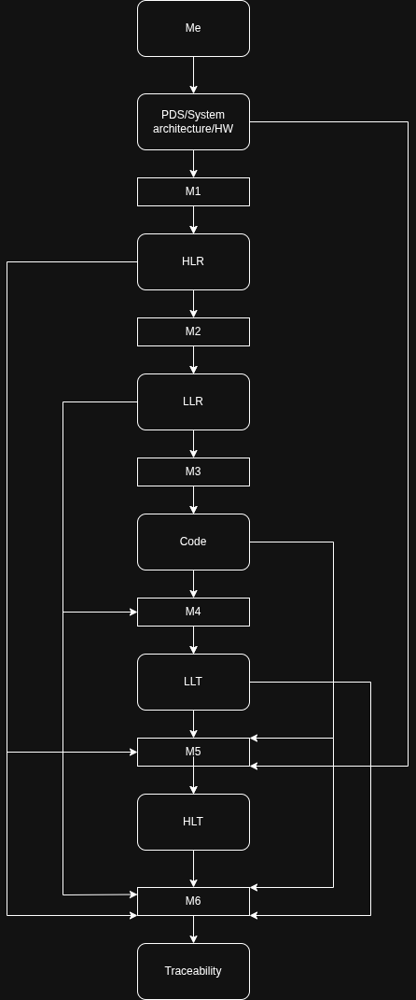

# I-SCEET
Intelligent Safety-Critical Environment Engineering Toolchain  
Hybrid AI + Deterministic Architecture for DO-178C Automation

## Architecture Overview

You (Engineer) provide:
- PDS (Product Design Specification)
- System Architecture
- Hardware Documentation (SoC, memory map, interfaces)

Pipeline:
1. **Model 1 → HLR**
2. **Model 2 → LLR + Software Architecture**
3. **Model 3 → Code Generation**
4. **Model 4 → LLT (Unit Test Scripts + Test Cases)**
5. **Model 5 → HLT (High-Level Test Scripts + Test Cases)**
6. **Model 6 → Traceability Matrix (HLR↔LLR↔Code↔LLT↔HLT)**

A shared **Chatbox** connects YOU ↔ ALL MODELS for interactive refinements.

## Repo Structure

## Architecture

